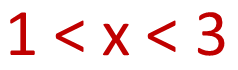
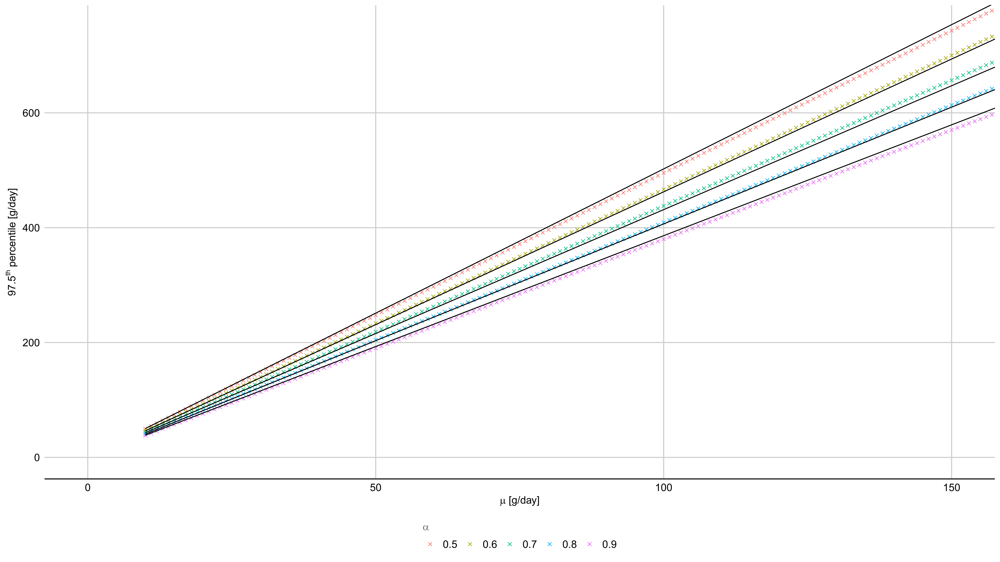

class: hide_logo

```{r setup, echo=FALSE, message=FALSE}
knitr::read_chunk('assets/init.R')
```

```{r init, echo=FALSE, cache=FALSE, message=FALSE}
<<init>>
```

## Outline `r top_icon("list")`
.black[
- ### Quantifying trends and distribution of risk factors for health
- ### Alcohol consumption as a case in point
]
--
.black[
- ### Why Bayes? 
- ### A Bayesian meta-regression model for alcohol consumption
]
--
.black[
- ### Results: a (brief) summary
- ### Conclusion
]

???
- Quantifying trends and distribution of risk factors for health
- Alcohol consumption as a case in point: mainstream estimation methods  

- Why Bayes? A principled approach to data synthesis
- A Bayesian meta-regression model for alcohol consumption: overview, implementation, fitting, checking

- Results: a (brief) summary
- Conclusion

---
background-image: url(images/data.png)
background-position: 50% 60%
background-size: 60%
## Data  `r top_icon("stethoscope")`

---
background-image: url(images/data1.png)
background-position: 50% 60%
background-size: 60%
## Data  `r top_icon("stethoscope")`
<br/>
<br/>
.font200[
.center[
Heterogeneous 

Sparse  
  
(often) biased
]
]

???
multiple, heterogeneous data sources

---
background-image: url(images/sample.png)
background-position: 10% 50%
background-size: 40%
## Estimating alcohol consumption  `r top_icon("wine-bottle")`

.font140[
.pull-right[

<div style = "margin-top:120px; margin-bottom: 60px;">Large uncertainty </img></div>
<div style = "margin-bottom: 50px;">Interval censored data </img></div>
<div>Large <span style = "color:red;">downward</span> bias </img></div></div>
]
]

---
class: hide_logo
background-image: url(images/coverage.png)
background-position: 50% 50%
background-size: 60%

.footnote[`r Citet(bib, "Probst2017a")`]
---
class: hide_logo
background-image: url(images/triang.png)
background-position: 10% 60%
background-size: 60% 
## The WHO approach  `r top_icon("wine-bottle")`

.footnote[
`r Citet(bib, "who2018")`, `r Citet(bib, "Rehm2010a")`, `r Citet(bib, "Kehoe2012")`
]

--
<div style = "position: absolute; left: 65%; top:15%; width:25%;">
</img>
<ul>
<li>Distribution shape</li>
<li>Constant coverage across subpopulations</li>
<li>Known prevalence of drinkers</li>
</ul>

</div>

---
class: hide_logo
background-image: url(images/steps.png)
background-position: 50% 50%
background-size: 100%

---
background-image: url(images/bayes.png)
background-position: 50% 50%
background-size: 100%
## Why Bayes?  `r top_icon("circle")`
<br/>
- ## Principled integration of multiple data sources
- ## Formal integration of (uncertain) assumptions as priors
- ## Improved quantification of the estimation error
- ## Recover of the full distribution of alcohol consumption

---
class: hide_logo
background-image: url(images/overview.png)
background-position: 50% 65%
background-size: 70%
## A meta-regression model  `r top_icon("code")`

--

<div style = "position: fixed; top: 270px; left: 220px; font-size: 160%;">
</img>
</div>

--

<div style = "position: fixed; top: 430px; left: 880px; font-size: 160%;">
</img>
</div>


---
class: hide_logo
## Data structure `r top_icon("divide")`
<br/>

$s \in \{1,..S\}$ = source survey  
$g \in \{1,2\}$, $a \in \{1,..A\}$ = sex and age category;  
$k \in \{1,..K\}$ = number of different consumption intervals;  

<br/>

.font140[
$$\require{color}\displaystyle\color{#FF0000}{pp_{s,g,a}, pse_{s,g,a}}$$
$$\require{color}\displaystyle\color{#FF0000}{TC_{s,g,a,k} = \left\{lc_{s,g,a,k}; uc_{s,g,a,k}; pc_{s,g,a,k}; ne_{s,g,a}\right\}}$$
<br/>
]

$lc_{s,g,a,k}, uc_{s,g,a,k}$  = bounds of the consumption intervals [g/day];  
$pc_{s,g,a,k}$ = proportion of subjects belonging to the consumption interval;  
$ne_{s,g,a}$ = effective sample size;  

???
The effective sample size  is calculated by distributing the total sample across all surveys according to the ‘quality effects weighting' approach by Doi and Colleagues,\Citep{Doi2015b}  which allows for integrating in a principled way the information on the precision of the survey estimates (as conveyed by their standard error) with the information of the relative quality of the data sources (as summarised by the risk of bias score).  
This relatively complex data structure is justified by the interval-censored nature of the survey data collected with frequency-quantity questionnaires, and avoids introducing the unmodeled error associated with using the middle point of the interval captured by the surveys to represent the actual consumption.

---
## Likelihood `r top_icon("divide")`
<br/>

 .font140[
$$\require{color}\displaystyle
\begin{align}
&L = \color{#FF0000}{\prod pc_{s,g,a,k}\cdot ne_{s,g,a}} \cdot L^{'}_{s,g,a,k} \prod L^{''}_{s,g,a}\nonumber\\
\nonumber\\
&L^{'}_{s,g,a,k} = \left\{\begin{array}{l}
    \Gamma(uc_{s,g,a,k} \vert \alpha_{y,g,a},\beta_{y,g,a}/c_{s,g,a}) \qquad if \; uc_{\cdot} = lc_{\cdot}\\\\
    \displaystyle \int_{x=lc_{s,g,a,k}}^{uc_{s,g,a,k}} \Gamma(x \vert \alpha_{y,g,a},\beta_{y,g,a}/c_{s,g,a})dx \qquad if \; uc_{\cdot} > lc_{\cdot}    
      \end{array}\right.\nonumber\\
\nonumber\\
&L^{''}_{s,g,a} = \mathcal{N}(pp_{s,g,a} \vert p_{y,g,a},pse_{s,g,a})\nonumber
\end{align}$$
]

---
## Smooth temporal trends `r top_icon("divide")`
<br/>

.red[.center[Average consumption among drinkers]]
$$\alpha_{y,g,a}=\left(\frac{\mu_{y,g,a}}{sd_{y,g,a}}\right)^2 \qquad;\qquad \beta_{y,g,a}=\alpha_{y,g,a}/\mu_{y,g,a}$$
$$\log(\mu_{y,g,a}) = \sum_{i=1}^{dc_1} \sum_{j=1}^{dc_2} s^{'}_{g,i,j} \Psi^{'}_i(year) \Phi^{'}_j(age) \qquad \forall g \in \{1,2\}$$ 
$$c_{s,g,a} = c_{s}^{'} \cdot c_{g,a}^{''}$$
.red[.center[Proportion of drinkers]]

$$logit(p_{y,g,a}) = \sum_{i=1}^{dp_1} \sum_{j=1}^{dp_2} s^{''}_{g,i,j} \Psi^{''}_i(year) \Phi^{''}_j(age) \qquad \forall g \in \{1,2\}$$
<br/>


---
## (Soft) constraints/1`r top_icon("divide")`
<br/>
<br/>
<br/>
.red[.center[Shape parameter &thickapprox; constant]]
$$\alpha_{y,g,a} = \sim \mathcal{N}(r_g,rs_g) \quad \forall y \in \{1,...Y\},\forall g \in \{1,2\},\forall a \in \{1,...A\}$$
<br/>
.red[.center[Total consumption per capita matches the APC form administrative data]]
$$\sum_{g=1}^{2}\sum_{a=1}^{A} \mu_{y,g,a} \cdot pop_{y,g,a} \cdot p_{y,g,a} \sim \mathcal{N}((1-w) \cdot apc_y,apcse_y) \qquad \forall y \in \{1,...Y\}$$

---
class: hide_logo
background-image: url(images/softbound.png)
background-position: 25% 80%
background-size: 30%
## (Soft) constraints/2`r top_icon("divide")`
<br/>
.red[.center[Average daily consumption (very) unlikely above 150 g]]

.pull-left[
 $$\begin{align}
f(x)= \begin{cases}
      \dfrac{0.975}{150} & x<150\\
      \nonumber\\
      0.0250e^{-0.26(x-150)} & x>=150\nonumber
    \end{cases}  
\end{align}$$</div>
]

--

.pull-right[
 $$\begin{align}
97.5^{th}\: percentile = \beta_0 + \beta_1 \mu + \beta_2 \alpha + \beta_3 \mu \alpha\nonumber 
\end{align}$$ 
]

</img> 

<div style = "position:absolute; left: 70%; top: 70%; ">
 $$\begin{align}
\begin{cases}
      \beta_0=3.259e^{-12}\\\nonumber
      \beta_0=6.397\\\nonumber
      \beta_0=-1.887e^{-12}\\\nonumber
      \beta_0=-2.884\\\nonumber
    \end{cases}  
\end{align}$$ 
</div>

---
class: hide_logo
background-image: url(images/stanlogo.jpg),url(images/rlogo.png),url(images/server.png),url(images/dot.png)
background-position: 20% 25%,40% 25%,10% 70%, 95% 55%
background-size: 10%, 10%,10%, 32%
## Implementation & Computation `r top_icon("check")`
<div style = "position:fixed; left: 22%; top: 50%; ">
CPU: Intel® Xeon® E5-1650 v3@3.5GHz<br/>
RAM: 16Gb RAM<br/>
OS: Linux Ubuntu 20.0<br/>   
<br/>
NUTS sampler <br/> 
110 000 samples (60% discarded)
</div>

<div style = "position:fixed; left: 70%; top: 40%; font-size: 140%;">
For all parameters: <br/>
R < 1.024 <br/>
ESS > 539 <br/>
MCSE < 5% <br/>
</div>

.footnote[`r Citet(bib, "stan2019")`, `r Citet(bib, "r2019")`,]

???
We implemented and fit the model with Stan v. 2.19[29] and used R v. 3.6[30]
for data manipulation, pre- and post-processing and graphing. We recovered the
posterior distribution of the parameters with Stan’s default Non-U-Turn Sampler
(NUTS), which is and adaptive version of the Hamiltonian Monte Carlo sampling
algorithm.[31] We drew a total of 110 000 samples (10 000 samples from each of 11
parallel chains), discarded the first 60% and used the remaining 44 000 to recover
the parameters of interest and the bounds of their 95% credible intervals (CI) as
the 50th, 2.5th and 97.5th percentile of the sampled distribution.

---
class: hide_logo
background-image: url(images/log_post_1.png),url(images/log_post_2.png),url(images/log_post_3.png), url(images/ppcheck.png)
background-position: 5% 25%,5% 55%,5% 85%, 85% 50%
background-size: 40%,40%,40%,40%,30%
## Model checking `r top_icon("check")`


???
We checked the convergence of the sampling algorithm by visually inspecting
the trace plots and calculating the Gelman and Rubin potential scale reduction
statistic ˆR,[32] and we calculated the effective sample size (ESS) and the Montecarlo
standard error (MCSE) for all parameters as indicators of the reliability of the
estimates.
As a posterior predictive checking, we analysed the discrepancies between the predicted
and observed distribution of consumption for each survey and we examined
the congruence of the distribution of residuals with the modelling assumptions.

The estimation of the model parameters took approximately 130 hours on a Linux
workstation (CPU: Intel® Xeon® E5-1650 v3@3.5GHz; RAM: 16 GB; OS: Ubuntu
v. 20.0). Model checking procedures supported the conclusion that the model
reached convergence (trace plots assuming the characteristics ‘caterpillar’ shape
and ˆR < 1.024 for all parameters), with acceptable values of effective sample size
and Montecarlo standard error (ESS > 539, MCSE < 5% of the posterior standard
deviation for all parameters).
The quantile-quantile plots of the standardised residuals did not suggest major
deviations from the assumed normality, both overall and within each survey.
The predicted distribution of average consumption among drinkers fit the data
reasonably well across surveys. In most cases the observed distribution was comprised
within the range of variability of the predictions, with some discrepancies
observed for high levels of consumption (above 50-60 g/day) in the three iterations
of the SABSSM survey. It must be considered that, because of the censored nature
of the data, the ‘observed’ distribution itself is only partially known. As an
example, Figure 2 compares the observed and predicted cumulative distribution of
average alcohol consumption among drinkers for the SADHS 1998 and SADHS 2016
surveys. Full results are reported in Additional File 1.

---
class: hide_logo
background-image: url(images/time.png)
background-position:50% 60%
background-size: 45%
## Results/1 `r top_icon("chart-line")`

.footnote[`r Citet(bib, "Cois2021")`]

---
class: hide_logo
background-image: url(images/age.png)
background-position:50% 70%
background-size: 80%
## Results/2 `r top_icon("chart-line")`

---
class: hide_logo
background-image: url(images/cats.png)
background-position:50% 60%
background-size: 80%
## Results/3 `r top_icon("chart-line")`

---
class: hide_logo
background-image: url(images/coverage1.png)
background-position:50% 60%
background-size: 60%
## Results/4 `r top_icon("chart-line")`

---
class: hide_logo
## Conclusions `r top_icon("stop")`
.pull-left[

- Plausible results
- Credible intervals includes uncertainty due to APC estimates, distribution shape, consumtpion limits...
- Relaxed assumptions regarding prevalence of drinkers and constant coverage
- Full characterisation of the distribution
- Flexibility 
]

--
.pull-right[
.center[
## Future developments
]

- Including a spatial dimension into the model
- Covariates
- Variabel coverage across drinking categories
- Computational efficiency

<div style = "position: fixed; top: 270px; left: 59%; width: 40%;"></img></div>
]

---
class: su-white hide_logo
<br/><br/>

.font80[
<p style ="font-size:400%; margin-bottom: -10px; margin-left: -5px;">Thank You!</p>
<div style = "margin-left:15px;">
`r icons::icon_style(icons::fontawesome("envelope"),fill = "#561a34")` [acois@sun.ac.za](mailto:acois@sun.ac.za)

ORCID: [0000-0002-7014-6510](https://orcid.org/0000-0002-7014-6510)

<p>Web of Science: [ AAK-8603-2020](https://www.webofscience.com/wos/author/rid/AAK-8603-2020)
]
</img> 
</div>
<br/>

<div style = "text-align: right; position: fixed; right: 100px;">
</img> <br/>
.font70[
This presentation is available from: <br/>
<a href = "https://annibalecois,github.io/metaregression">https://annibaleaois.github.io/metaregression</a> <br/>
and the generating code from: <br/>
<a href = "https://github.com/annibalecois/metaregression">https://github.com/annibalecois/metaregression</a> <br/>
]
</div>

---
class: hide_logo
## References  
<br/>
.font80[
```{r, echo=FALSE, cache=FALSE, message=FALSE, results = 'asis'}
PrintBibliography(bib)
```
]